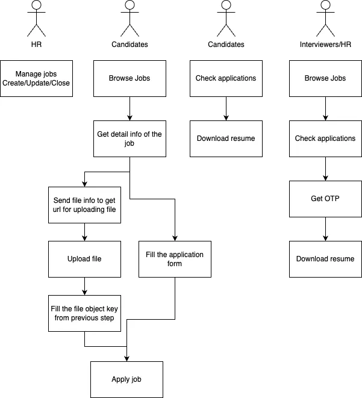
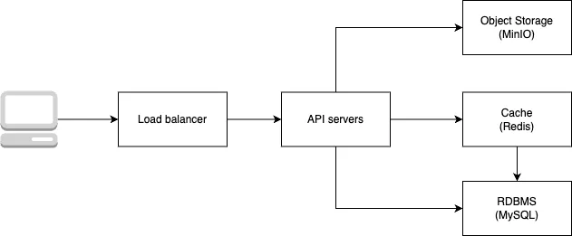

# Technical Challenge from fliQt
interviewee: [BoHsiang Huang - calvin.peak@finalbuild.zip](mailto:calvin.peak@finalbuild.zip)

# Designing a HR system API
Since this project is built for an interview, I wanna ensure that we focus on the most core part, which is demonstrating my technical skills. I have marked some of the functional requirements below and tried to make the project smaller. Perhaps we can discuss the items that were deleted at some point.

## Functional requirements
- There are 3 different roles of characters using this system: candidate, interviewer, HR.
- Candidates can search for jobs and filter by title, job description, salary range and job type.
- Candidates can check their application status.
- ~~HR can use the system to manage schedules and status.~~
- HR can manage applications from candidates.
- A job can be created/updated, or closed by HR.
- ~~The system can organize interview schedule.~~

## Non-functional requirements
- Since resumes contain highly confidential data, interviewers and HR must pass the 2FA before downloading them.
- ~~Analysing resumes and making a score for each candidates.~~
- Records every operation for tracking purposes.

I also simplified user authentication for users. You can easily use the `X-FLIQT-USER` header to interact with API as a specific user.
```sh
$ curl -H 'X-FLIQT-USER: [candidate 1's id]' http://localhost:8080/api/applications
```

## Documentations

### OpenAPI
You can find the `openapi.yml` at the root of this project and also a exported OpenAPI html file - `openapi.html` rendered by ReDoc2.

To update `openapi.html` -
```sh
$ docker run --rm -v $PWD:/spec redocly/cli build-docs openapi.yml -o openapi.html
```

### Flowcharts / Infrastructure




https://drive.google.com/file/d/1vYn7QidvFYOtyiVChvJDVu_SOAKcQ1wo/view?usp=sharing

# How to Run the Code
## Environment Variables
| Name | Description | Default |
|------|-------------|---------|
|`DB_HOST`| DB host (This project only supports MySQL) | `localhost`|
|`DB_PORT`| DB port (This project only supports MySQL) | `3306`|
|`DB_USER`| DB username | `root`|
|`DB_PASSWORD`| DB password | `password` |
|`DB_TIMEZONE`| DB timezone | `Etc/UTC` |
|`DB_NAME`| DB name | `fliqt_test`|
|`DB_MAX_IDLE`| DB maximum connections in idle connection pool | 2 |
|`DB_MAX_CONN`| DB maximum number of open connections | 10 |
|`DB_MAX_LIFE`| DB maximum amount of time  amount of time a connection may be reused | 2 |
|`DEBUG`| Config for debugging mode | `false` |
|`PRETTY_LOG`| Easier to read the log | `false` |
|`TRACER_ENDPOINT`| The tracer collector's endpoint | `localhost:4317` |
|`REDIS_URL`| Redis URL | `redis://localhost:6379` |
|`S3_ENDPOINT`| S3 endpoint, we're using minio as default | `http://localhost:9000` |
|`S3_BUCKET`| S3 bucket name | `fliqt` |
|`S3_REGION`| S3 region, and its meanless when using minio | `us-east-1` |
|`S3_KEY`| S3 access key |  |
|`S3_SECRET`| S3 secrey key |  |

# Migrations
This project uses `github.com/go-gormigrate/gormigrate` as the migrator base and includes a small program to execute migrations.

```sh
# Execute all migrations when no specific version is specified.
$ go run cmd/migrate/main.go

# Execute migrations up to a specific version.
$ go run cmd/migrate/main.go -version=10

# Rollback all migrations.
$ go run cmd/migrate/main.go -rollback

# Rollback migrations to a specific version.
$ go run cmd/migrate/main.go -rollback -version=10
$ go run cmd/migrate/main.go -rollback-to=10
```

Or you can use the `Makefile` to run migrations.
```sh
# Mofidy the .env file for your settings.
$ make dev-db-migrate
$ make dev-db-rollback
```

## Seed data

Jobs
| id                       | title                  | company   | job_type | salary_min | salary_max |
|--------------------------|------------------------|-----------|----------|------------|------------|
| cqanjjocvavk14kcpc9g     | Software Engineer      | Google    | full-time | 100000     | 200000     |
| cqank1gcvavk2ohtbi90     | Software Engineer      | Facebook  | full-time | 100000     | 200000     |
| cqank6ocvavk3bku7rhg     | Software Engineer      | Amazon    | full-time | 100000     | 200000     |
| cqank8gcvavk3o6tsqb0     | Software Engineer      | Apple     | full-time | 100000     | 200000     |
| cqankhocvavk4lkbb63g     | Sr. Software Engineer  | Google    | full-time | 200000     | 300000     |
| cqanl4gcvavk5aka0am0     | Infrastructure Engineer| Facebook  | full-time | 150000     | 200000     |
| cqanlbocvavk60s8l840     | Designer Manager       | Amazon    | full-time | 100000     | 200000     |

Users
| id                       | role         | totp_secret                      |
|--------------------------|--------------|-----------------------------------|
| cqan84gcvavjif3csp4g     | hr           | UGLOBAFSYEIDW52JGKUEFEQFEB3RZFYL  |
| cqanb5gcvavjneudu13g     | interviewer  | 7KIHH3TKGHNS67UHG4JLS5QPYN4SKTQC  |
| cqanbg8cvavjpljmh7pg     | candidate    | TXMJIAOMR42PQP2A5JWC7SPOIHEKI3X2  |

# To start the API server
```sh
$ docker build -t fliqt-test .
$ docker run --name fliqt-test -p8080:8080 --env DB_NAME=[DB name] --env DB_PASSWORD=[DB password] --env DEBUG=true --env PRETTY_LOG=true fliqt-test:latest ./dist-main
```

Or simply use the prepared `docker-compose.yaml` to start the service
```sh
$ docker-compose up --build
```
